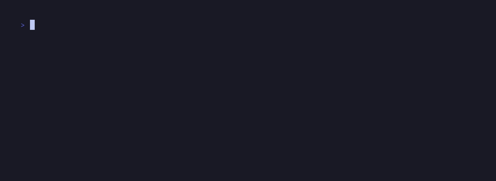

<div align="center">
<pre>
░█▀▀░█▀█░▀█▀░█▀▄░█▀▀░█▀▄
░▀▀█░█▀▀░░█░░█░█░█▀▀░█▀▄
░▀▀▀░▀░░░▀▀▀░▀▀░░▀▀▀░▀░▀<br>
[ Web Crawler - Image Downloader ]
</pre>
</div>

### **Build**
```sh
go build
```

### **Usage**
```sh
./spider [-rlph] URL
```
    Options:
      -l uint
            indicates the maximum depth level of the recursive download.
            (default 5)

      -p string
            indicates the path where the downloaded files will be saved.
            (default "./data/")

      -r    recursively downloads the images in a URL received as a parameter.

      -h    display help

### **Description**

#### **Crawler**
> Parse a web domain through a given URL to download specific image formats
> (**JPEG** | **PNG** | **GIF** | **BMP**).

#### **Architecture**
> Built with **Go** standard library only.<br>
> Make use of **goroutines** to implement a multithreaded flow as shown below in
> the logic diagram of the core function **CrawlUrl**.

```go
func (spider *Spider) CrawlURL(recursionDepth uint, rawURL string) error
```
<div align="center">
  
</div>

#### **Demo**
> **Default**
<div align="center">
  
</div>
<br>

> **Recursive**
<div align="center">
  
</div>
